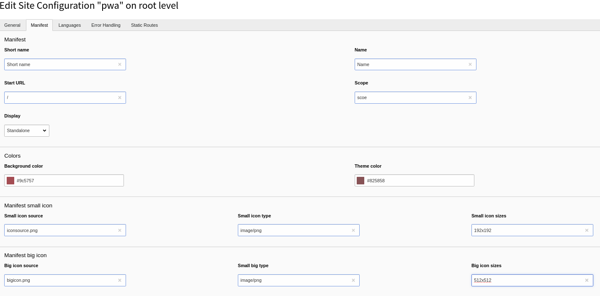

# TYPO3 Extension "PWA Manifest"

[](https://travis-ci.org/TYPO3-Initiatives/pwa_manifest)

This extension adds PWA Web App Manifest configuration in TYPO3 Site Configuration

If you have any questions just drop a line in #initiative-pwa Slack channel.

## Requirements

Extension requires TYPO3 in version at least 9.5.

| Version | TYPO3       |
|---------|-------------|
| 2.x     | 12.0 - 12.4 |
| 1.x     | 9.5 - 11.5  |

## Installation

Install extension using composer\
``composer require friendsoftypo3/pwa_manifest``

then, include typoscript template, and go to page with ?type=835.

## Configuration

Go straight to Site Configuration in your TYPO3 backend and edit your page.


## Web App Manifest

Check [reference](https://developers.google.com/web/fundamentals/web-app-manifest) for more information.

 ``` 
 {
    "short_name": "Maps",  
    "name": "Google Maps",
    "icons": [
      {
        "src": "/images/icons-192.png",
        "type": "image/png",
        "sizes": "192x192"
      },
      {
        "src": "/images/icons-512.png",
        "type": "image/png",
        "sizes": "512x512"
      }
    ],
    "start_url": "/maps/?source=pwa",
    "background_color": "#3367D6",
    "display": "standalone",
    "scope": "/maps/",
    "theme_color": "#3367D6"
  }
  ```

## Development

Development for this extension is happening as part of the TYPO3 PWA initiative,
see https://typo3.org/community/teams/typo3-development/initiatives/pwa/

## Credits

A special thanks goes to [macopedia.com](https://macopedia.com) company, which is sponsoring development of this
solution.

### Developers involved in the project

- Łukasz Uznański (Macopedia)


